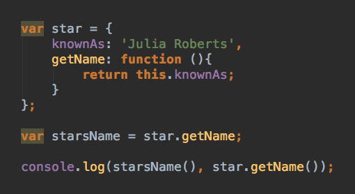

### Looking at the code below, what is the console log you would get (25%) and why (75%):

(Please view the rendered image below on github.com, not in vscode)

1. undefined undefined
1. undefined 'Julia Roberts'
1. 'Julia Roberts' 'Julia Roberts'
1. 'Julia Roberts' undefined

### Answer:

1. undefined undefined, because the "this" in the getName method only references the method itself, not the whole object, so its scope there is nothing assigned to that value.

Incorrect - 'this' is referring to the object that owns it. In this case, that object would be 'star' and what is the value of knownAs? - Julia Roberts

When logged, you would get undefined, Julia Roberts.